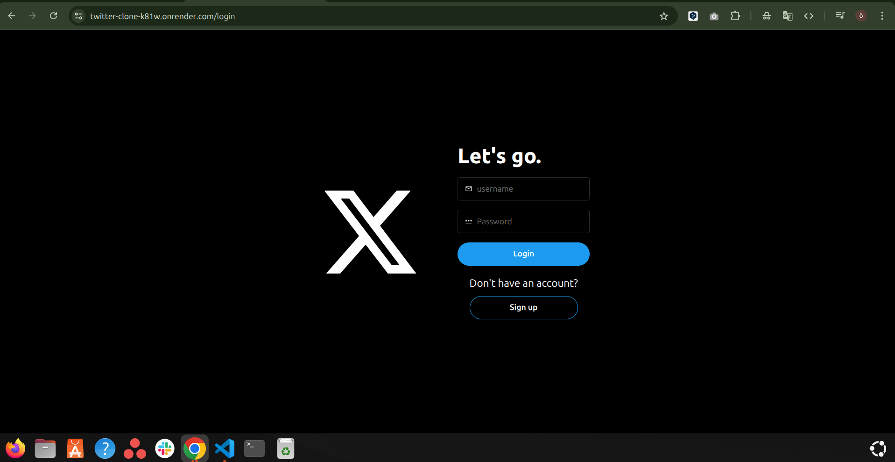
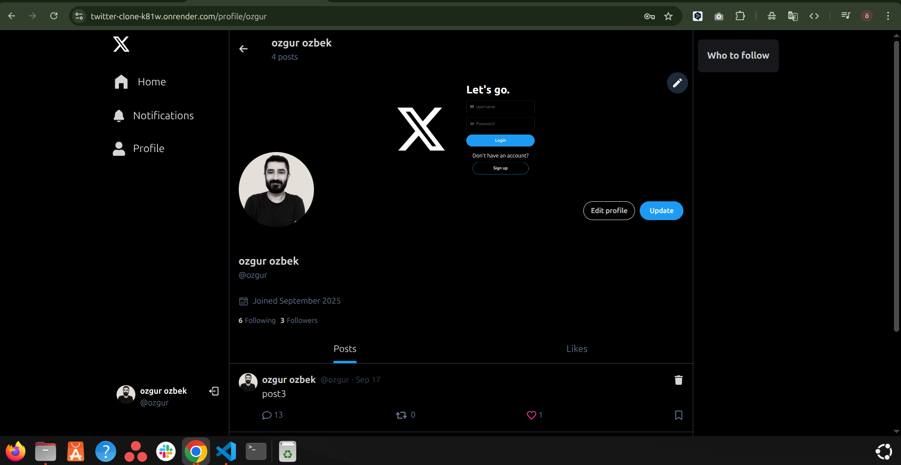

# Twitter Clone – MERN Stack

A full-stack Twitter clone built with the **MERN stack** (MongoDB, Express, React, Node.js).  
It features **JWT authentication**, a modern **React + Tailwind CSS** frontend, and efficient data fetching with **React Query**.  
Users can register, log in, create posts, like, and comment in real time, providing a social media experience similar to Twitter.  

---

  
  
